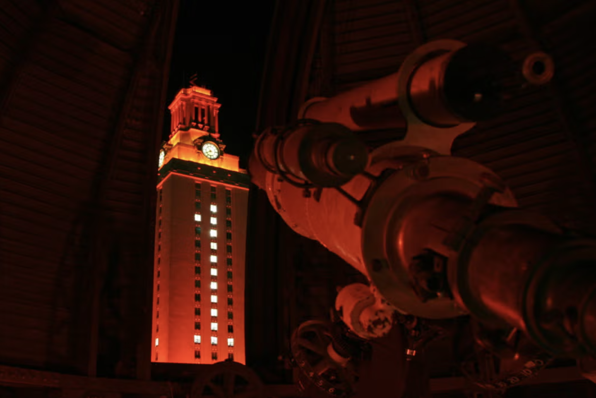

# Welcome to the UT Astronomy Graduate Wiki

This wiki serves as a centralized resource hub for graduate students in the UT Astronomy Department. 

Here you will find important information including:

- Grad Student Resources 
- Class Material 
- Latex Templates
- <a href="https://docs.google.com/document/d/1YoKGIfiDcwsxBudUTGX42SvS7A1Ex6t-tMrVdqnEch4/edit?usp=sharing" target="_blank" rel="noopener noreferrer">
  Grad Student A-Z TLDR version
</a>
- How to get Involved in Department Events

Our goal is to foster collaboration and make essential resources easily accessible for everyone in the department.

---

If you have any questions, suggestions, or contributions to improve this wiki, please feel free to contact the department archivist. 

Your feedback is invaluable in keeping this resource current and helpful.

Welcome, and happy exploring!

<!--## 📚 Quick Links
- [Templates](templates.md)
- [Resources](resources.md)
- [Quals Prep](quals_prep.md)
-->
